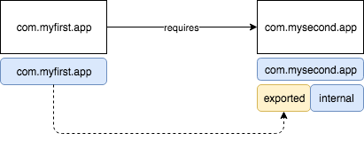

# java-9-modules-1

In this example I set up two minimal modules to see how a module can use another module. Moreover, one can also see how that other module can limit what it exposes.

* `com.myfirst.app`
* `com.mysecond.app`



So basically, what we have is a class `Main.java` on module `com.myfirst.app`, using another class `NameProvider.java` defined in the other module `com.mysecond.app`.

Take a look into both `module-info.java` files to see how the project is set up.

## Compile

In order to compile the project you can just:

```bash
$ ./compile.sh
```

## Run

To run that example just type:

```bash
$ ./run.sh
```