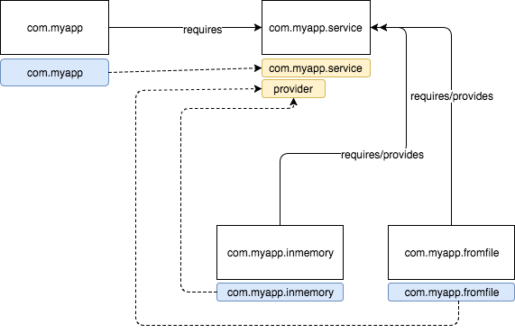

# java-9-modules-2

In this example I have created 3 minimal modules to explore how Services and providers in Java 9 work.

> Services allow for loose coupling between service consumers modules and service providers modules.

Here you can see those 3 modules:

* `com.myapp` : that uses the `com.myapp.service` module to get a `Repository` (thus it is a service consumer)
* `com.myapp.service` : that makes use of the `ServiceLocator` to find an implementation for the requested service provider.
* `com.myapp.inmemory` : that provides an implementation for the `RepositoryProvider` service and `Repository` interface that will be used by the `com.myapp` module.
* * `com.myapp.fromfile` : that provides another implementation for the `RepositoryProvider` service and `Repository` interface that will be used by the `com.myapp` module.



Take a look into the `module-info.java` files to see how the project is set up.

## Compile

In order to compile the project you can just:

```bash
$ ./compile.sh
```

## Run

To run that example just type:

```bash
$ ./run.sh
```